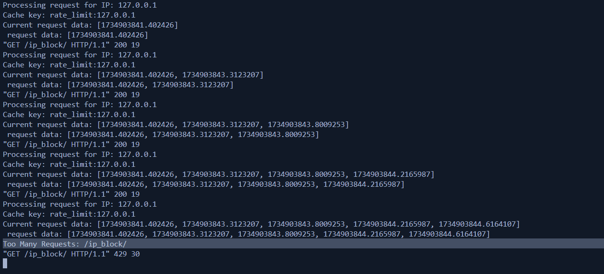

# Rate-Limiting Middleware in Django

## Rolling Window Rate Limiting Implementation

This middleware implements rate-limiting for each IP address based on a rolling 5-minute window. The system tracks the number of requests from an IP and blocks further requests once the IP exceeds 100 requests within the window. The rolling window ensures that only requests within the last 5 minutes are counted.

### How it Works:
app_ip/middleware/ip_filter.py - [Link](app_ip/middleware/ip_filter.py)
1. The middleware identifies the client's IP from the request headers.
2. Timestamps of the requests are stored in a cache (Redis/Django Cache).
3. The middleware checks if the number of requests within the last 5 minutes exceeds 100. If so, it responds with a `429 Too Many Requests` status.
4. The remaining allowed requests and the limit are included in the response headers.

## Testing Locally

1. Install dependencies:
    ```bash
    pip install django-redis
    ```
2. Configure Redis in `settings.py`:
   ```python
        CACHES = {
    'default': {
        'BACKEND': 'django_redis.cache.RedisCache',
        'LOCATION': 'redis://127.0.0.1:6379/1',
        'OPTIONS': {
            'CLIENT_CLASS': 'django_redis.client.DefaultClient',
        }
    }
    }
    ```
    - Add the cache configuration as shown .
    - Make sure you have a Redis server running on `localhost` (port 6379).
4. Add the middleware in `settings.py`:
    ```python
    MIDDLEWARE = [
        # Other middleware
        'your_project.middleware.RateLimitMiddleware',
    ]
    ```
5. Test the middleware by sending requests by jmeter and RateLimitingMiddlewareTests


## Screenshots


log response if rate limit is 5



Jmeter resposne for 100 rate limit


